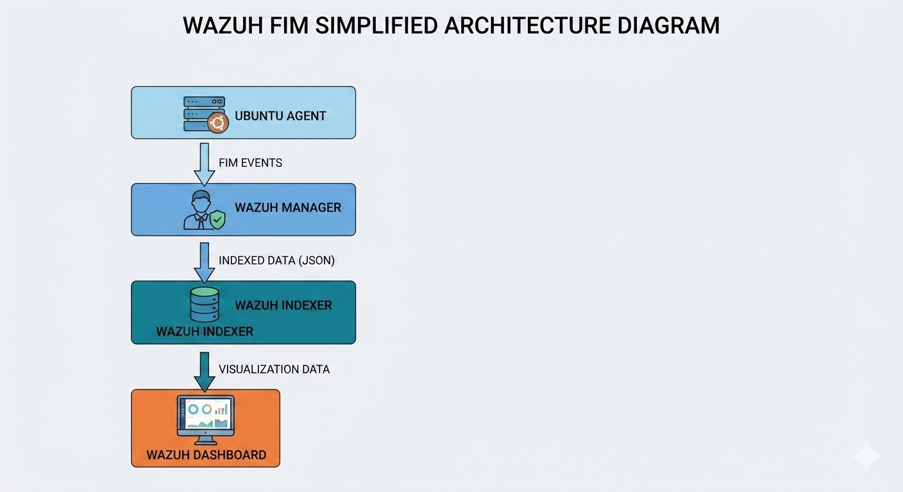
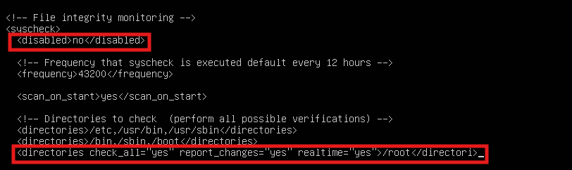
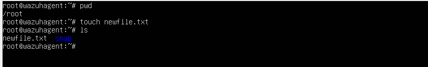
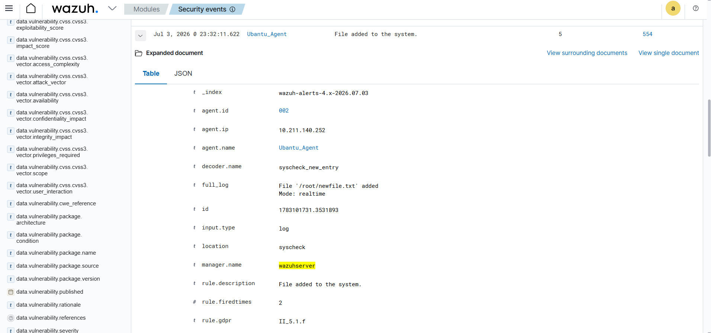
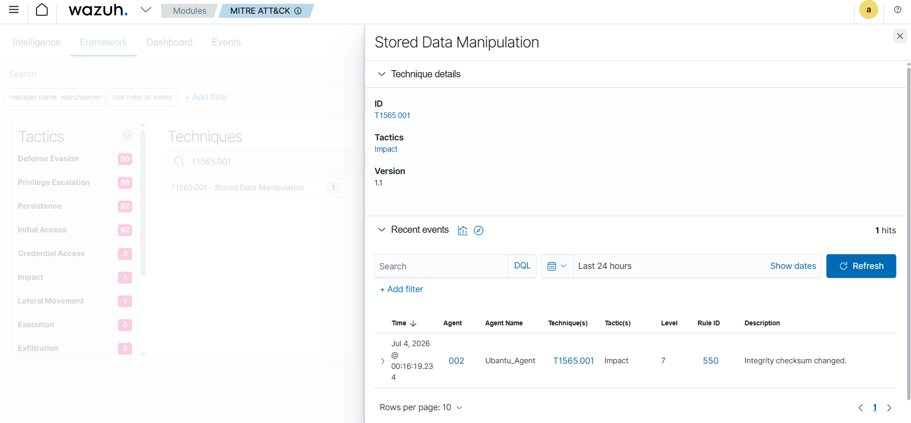

# File Integrity Monitoring (FIM) Using Wazuh SIEM

## Project Overview

This project demonstrates how **Wazuh File Integrity Monitoring (FIM)** can detect unauthorized changes to critical files and directories on Linux systems.

The lab simulates real-world scenarios where attackers modify sensitive files, and Wazuh generates alerts to help security analysts identify suspicious activities.

---

## Objectives

- Understand File Integrity Monitoring (FIM)
- Configure Wazuh FIM on Linux
- Monitor sensitive directories
- Simulate unauthorized file modifications
- Generate and analyze security alerts
- Document incident findings

---

## Lab Environment

| Component | Details |
|-----------|----------|
| SIEM | Wazuh 4.x |
| Manager OS | Ubuntu Server |
| Agent OS | Ubuntu Server |
| Virtualization | VirtualBox |
| Monitoring Feature | File Integrity Monitoring (FIM) |

---

## Architecture Diagram

<p align="center">
  
</p>

---

## Prerequisites

- Wazuh Manager installed
- Ubuntu Agent installed
- Agent connected to the Manager
- Root privileges

---

## Configure File Integrity Monitoring

Open the Wazuh configuration file:

```bash
sudo nano /var/ossec/etc/ossec.conf
```

Scroll down until you find the **File Integrity Monitoring (Syscheck)** section.

Verify that the following configuration is present:

<p align="center">
  
</p>


This means **File Integrity Monitoring (FIM)** is enabled.

---

## Restart Wazuh Agent

```bash
sudo systemctl restart wazuh-agent
```

---

## Verify Configuration

```bash
systemctl status wazuh-agent
```

---

## Attack Simulation

### Create a File

```bash
touch newfile.txt
```

<p align="center">
  
</p>

---

## Detection Results

Wazuh successfully generated alerts for:

- File creation

<p align="center">
  
</p>

---

## Incident Analysis

### MITRE ATT&CK Technique

**T1565 – Stored Data Manipulation**

<p align="center">
  
</p>

### Potential Risks

- Unauthorized configuration changes
- Malware persistence
- Insider threats

---

## Key Learnings

- Learned how File Integrity Monitoring (FIM) works.
- Configured the Wazuh Syscheck module.
- Simulated file tampering scenarios.
- Investigated alerts from the Wazuh Dashboard.
- Understood the importance of monitoring critical files.
